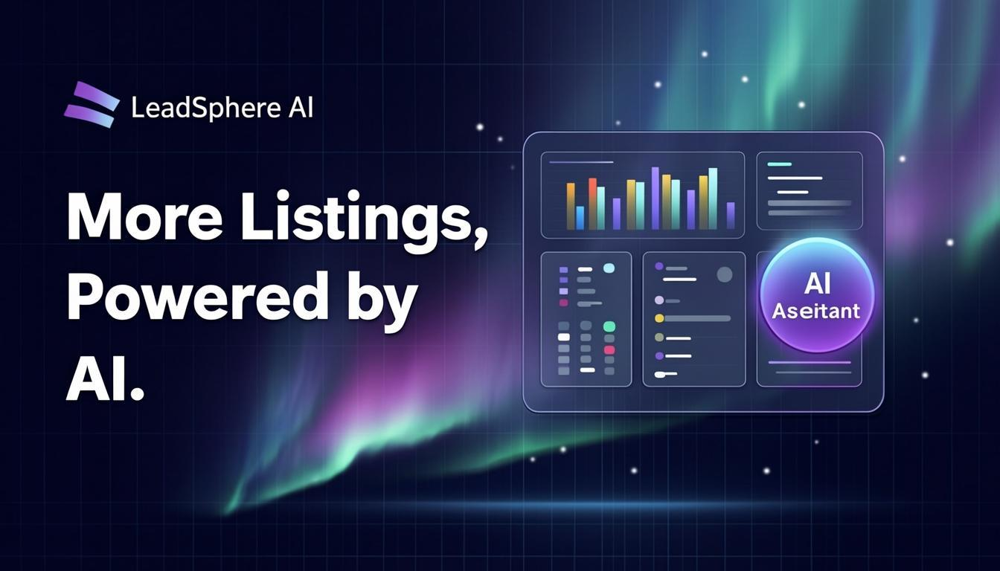

# LeadSphere AI

> **More Listings. Powered by AI.**
>
> A premium, AI-powered Real Estate Lead Generation platform — luxury SaaS landing experience built with Next.js 16, TypeScript, Tailwind CSS 4, and Framer Motion.



## ✨ Features

- **Cinematic Hero** — floating 3D glassmorphism dashboard with cursor-parallax depth, aurora background, particles & light rays.
- **Interactive Demo** — a real, tabbed SaaS dashboard (CRM, Pipeline, Lead Map, Analytics, Marketing, Dialer) with live recharts.
- **AI Sales Assistant "Sphere"** — a working conversational chat widget backed by an LLM (`/api/ai-assistant`) that qualifies leads and recommends plans.
- **ROI Calculator** — interactive sliders that project listings, revenue & ROI in real time.
- **Drag-and-drop CRM Kanban** powered by `@dnd-kit`.
- **Animated stats, process timeline, interactive lead map, integrations grid, testimonials carousel.**
- **Pricing** (3 tiers + monthly/annual toggle), **FAQ accordion**, **CTA banner**, full **footer**.
- **Branded loading screen**, **cursor glow**, **magnetic buttons**, scroll reveals, and premium micro-interactions throughout.
- Fully responsive, dark luxury aesthetic, accessible, SEO-optimized with OG image & favicon.

## 🛠 Tech Stack

- **Framework:** Next.js 16 (App Router) + TypeScript 5
- **Styling:** Tailwind CSS 4 + shadcn/ui (New York)
- **Animation:** Framer Motion
- **Charts:** Recharts
- **Drag & Drop:** @dnd-kit
- **AI:** z-ai-web-dev-sdk (LLM) — server-side only
- **Icons:** lucide-react

## 🚀 Getting Started

```bash
# Install dependencies
bun install

# Start the dev server (http://localhost:3000)
bun run dev

# Lint
bun run lint
```

## ☁️ Deploy on Vercel

1. Push this repo to GitHub.
2. Go to [vercel.com/new](https://vercel.com/new) and import the repository.
3. Vercel auto-detects Next.js — no config needed.
4. Click **Deploy**.

> The AI Assistant API route (`/api/ai-assistant`) uses `z-ai-web-dev-sdk`. Ensure the required environment credentials are available in your Vercel project (the SDK reads them automatically in supported environments).

## 📁 Project Structure

```
src/
├── app/
│   ├── api/ai-assistant/route.ts   # LLM-powered chat endpoint
│   ├── globals.css                 # Dark theme + glassmorphism utilities
│   ├── layout.tsx                  # Metadata, fonts, favicon, OG image
│   └── page.tsx                    # Single-page landing site
├── components/
│   ├── leadsphere/                 # Brand components & sections
│   │   ├── sections/               # Hero, Demo, CRM, Pricing, etc.
│   │   ├── primitives.tsx          # GlassCard, CountUp, SectionHeading
│   │   ├── Hero.tsx, Navbar.tsx, ...
│   │   └── ...
│   └── ui/                         # shadcn/ui components
└── lib/leadsphere/hooks.ts         # useMouseParallax, useCountUp, useInView
```

## 📄 License

MIT — built as a portfolio piece.
